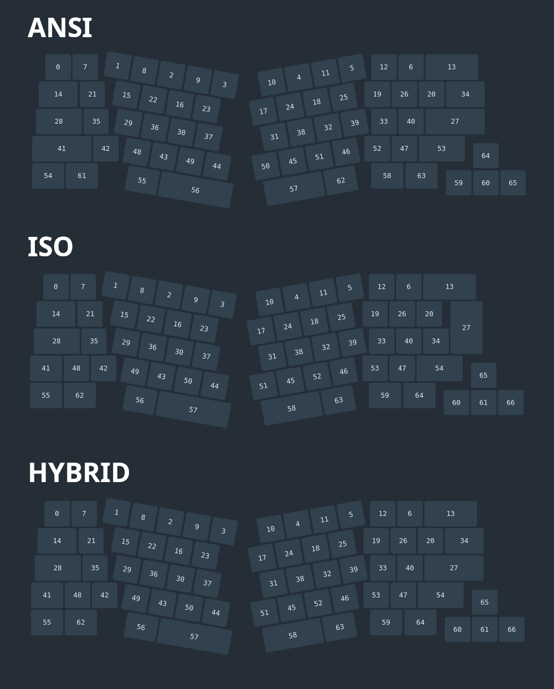

# ZMK files for Sunshine keyboard

Firmware configuration and keymap definitions for the Sunshine keyboard powered by [ZMK Firmware](https://zmk.dev/).

## Layouts

To keep things simple and easy to maintain, both ANSI and ISO layouts coexist in a single **hybrid layout**.

The hybrid layout combines:

- the **ANSI-style right section**, including the standard **Return** [27] and **Backslash** [34] keys,
- with the **ISO-style left section**, featuring a **split left Shift** [41] and an **extra key** [48].

> **In ZMK Studio, you’ll always see this hybrid layout**, regardless of how your keyboard is actually soldered.

Additional notes:

- The **Return** and **Backslash** keys are wired so that they work as expected on both ANSI and ISO builds. No firmware change is required.
- The **extra key** [48] near the split left Shift is *only available* if you’ve soldered the ISO-style Shift.
  On an ANSI build, that key will be inaccessible even though it appears in ZMK Studio.

## Encoders

Both encoders are enabled by default since the left one is meant to be always installed.
The right encoder is optional and can be soldered in place of one of the spacebars.

## Keymaps

The default firmware provides **four layers**.

